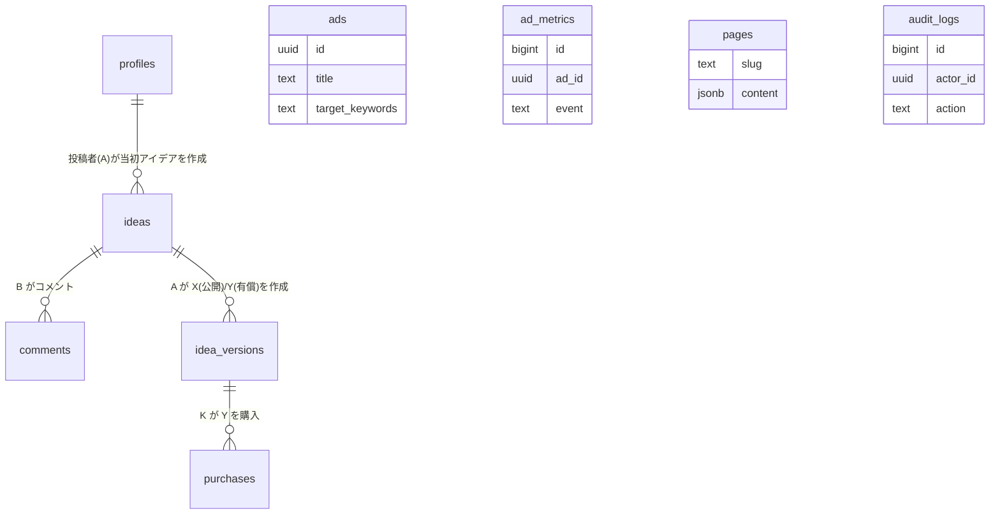

# アイデアマーケット｜DB設計書（Supabase PostgreSQL）v1.0

**対象：** ホームページ刷新（Wix→AWS/Supabase）

**要件：** 当初アイデア＋コメント（LINE風）、最終アイデア X（公開）/ Y（有償・購入後閲覧）、CMT 番号検索、検索連動広告、CMS（規約/技術/会社情報）、管理画面（ログDL）

---

## 0. 前提・指針

- **DB：** PostgreSQL 15（Supabase マネージド）
- **タイムゾーン：** DB=UTC（アプリ表示は JST）
- **文字コード：** UTF-8
- **拡張：** pgcrypto（UUID）, pg_trgm（検索, P0）, uuid-ossp（任意）, btree_gin
- **命名規約：** スネークケース、id は uuid、監査列 created_at/updated_at は timestamptz
- **RLS：** Supabase の RLS を全テーブルで有効化。auth.uid() を利用


---

## 1. ER 図（論理・要約）



### 主要リレーション
- **profiles(1) — (N) ideas：** 投稿者（A）が当初アイデアを作成
- **ideas(1) — (N) comments：** B がコメント
- **ideas(1) — (N) idea_versions：** A が X（公開）/Y（有償）を作成
- **idea_versions(Y)(1) — (N) purchases：** K が Y を購入

### その他テーブル
- **ads：** 検索語に連動して表示
- **ad_metrics：** impression/click を計測
- **pages：** 規約/技術/会社情報の CMS
- **audit_logs：** 作成/更新/削除/権限/決済などの監査


---

## 2. 型・拡張の作成

```sql
-- 必要な拡張機能
CREATE EXTENSION IF NOT EXISTS pgcrypto; -- gen_random_uuid()
CREATE EXTENSION IF NOT EXISTS pg_trgm;   -- 全文検索
CREATE EXTENSION IF NOT EXISTS btree_gin; -- GINインデックス

-- ENUM 型定義
CREATE TYPE role AS ENUM ('member','company','admin');
CREATE TYPE version_type AS ENUM ('X','Y');
CREATE TYPE purchase_status AS ENUM ('succeeded','refunded','failed');
```


---

## 3. テーブル定義（DDL）

### 3.1 プロファイル / ロール

```sql
CREATE TABLE public.profiles (
  id uuid PRIMARY KEY REFERENCES auth.users(id) ON DELETE CASCADE,
  role role NOT NULL DEFAULT 'member',
  display_name text,
  created_at timestamptz NOT NULL DEFAULT now(),
  updated_at timestamptz NOT NULL DEFAULT now()
);

-- インデックス
CREATE INDEX ON public.profiles(role);

-- 更新時刻自動更新トリガー
CREATE TRIGGER trg_profiles_updated_at
  BEFORE UPDATE ON public.profiles
  FOR EACH ROW EXECUTE PROCEDURE public.set_updated_at();
```

### 3.2 CMT 採番補助（当日連番）

```sql
-- CMT番号の連番管理テーブル
CREATE TABLE public.cmt_counters (
  seq_date date PRIMARY KEY,
  last_no int NOT NULL DEFAULT 0,
  updated_at timestamptz NOT NULL DEFAULT now()
);

-- CMT番号生成関数（CMT-YYMMDD-0001形式）
CREATE OR REPLACE FUNCTION public.generate_cmt_no()
RETURNS text LANGUAGE plpgsql AS $$
DECLARE 
  v_next int; 
  v_date text; 
BEGIN
  INSERT INTO public.cmt_counters(seq_date, last_no)
    VALUES (current_date, 1)
  ON CONFLICT (seq_date)
    DO UPDATE SET 
      last_no = public.cmt_counters.last_no + 1,
      updated_at = now()
    RETURNING last_no INTO v_next;
  
  v_date := to_char(current_date, 'YYMMDD');
  RETURN 'CMT-' || v_date || lpad(v_next::text, 4, '0');
END; $$;
```

### 3.3 当初アイデア & コメント

```sql
-- 当初アイデアテーブル
CREATE TABLE public.ideas (
  id uuid PRIMARY KEY DEFAULT gen_random_uuid(),
  author_id uuid NOT NULL REFERENCES public.profiles(id) ON DELETE CASCADE,
  cmt_no text NOT NULL UNIQUE, -- CMT-YYMMDD0001
  title text NOT NULL,
  summary text NOT NULL,
  tags text[] NOT NULL DEFAULT '{}',
  status text NOT NULL DEFAULT 'published' CHECK (status IN ('draft','published')),
  created_at timestamptz NOT NULL DEFAULT now(),
  updated_at timestamptz NOT NULL DEFAULT now()
);

-- インデックス
CREATE INDEX idx_ideas_author ON public.ideas(author_id);
CREATE INDEX idx_ideas_tags ON public.ideas USING gin (tags);
CREATE INDEX idx_ideas_summary_trgm ON public.ideas USING gin (summary gin_trgm_ops);

-- CMT番号自動設定トリガー
CREATE TRIGGER trg_ideas_set_cmt
  BEFORE INSERT ON public.ideas
  FOR EACH ROW WHEN (new.cmt_no IS NULL)
  EXECUTE PROCEDURE public.set_cmt_no();

-- CMT番号設定関数（generate_cmt_no()のラッパー）
CREATE OR REPLACE FUNCTION public.set_cmt_no()
RETURNS trigger LANGUAGE plpgsql AS $$ 
BEGIN
  new.cmt_no := public.generate_cmt_no();
  RETURN new; 
END; $$;

-- 更新時刻自動更新トリガー
CREATE TRIGGER trg_ideas_updated_at
  BEFORE UPDATE ON public.ideas
  FOR EACH ROW EXECUTE PROCEDURE public.set_updated_at();

-- コメントテーブル
CREATE TABLE public.comments (
  id uuid PRIMARY KEY DEFAULT gen_random_uuid(),
  idea_id uuid NOT NULL REFERENCES public.ideas(id) ON DELETE CASCADE,
  author_id uuid NOT NULL REFERENCES public.profiles(id) ON DELETE CASCADE,
  body text NOT NULL,
  attachments jsonb NOT NULL DEFAULT '[]',
  created_at timestamptz NOT NULL DEFAULT now()
);

-- インデックス
CREATE INDEX idx_comments_idea_time ON public.comments(idea_id, created_at);
```

### 3.4 最終アイデア（X/Y）

```sql
-- 最終アイデアバージョンテーブル（X版/Y版）
CREATE TABLE public.idea_versions (
  id uuid PRIMARY KEY DEFAULT gen_random_uuid(),
  idea_id uuid NOT NULL REFERENCES public.ideas(id) ON DELETE CASCADE,
  type version_type NOT NULL, -- 'X' or 'Y'
  title text NOT NULL,
  summary text NOT NULL,
  body text, -- Y で必須（アプリ側で検証）
  price int CHECK (price >= 0), -- Y で必須
  is_public boolean NOT NULL DEFAULT false, -- X=true, Y=false
  purchase_count int NOT NULL DEFAULT 0,
  created_at timestamptz NOT NULL DEFAULT now(),
  updated_at timestamptz NOT NULL DEFAULT now()
);

-- インデックス
CREATE INDEX idx_versions_idea_type ON public.idea_versions(idea_id, type);
CREATE INDEX idx_versions_public ON public.idea_versions(is_public);
CREATE INDEX idx_versions_title_trgm ON public.idea_versions USING gin (title gin_trgm_ops);
CREATE INDEX idx_versions_summary_trgm ON public.idea_versions USING gin (summary gin_trgm_ops);

-- 更新時刻自動更新トリガー
CREATE TRIGGER trg_versions_updated_at
  BEFORE UPDATE ON public.idea_versions
  FOR EACH ROW EXECUTE PROCEDURE public.set_updated_at();
```

### 3.5 購入（Stripe 決済後付与）

```sql
-- 購入履歴テーブル
CREATE TABLE public.purchases (
  id uuid PRIMARY KEY DEFAULT gen_random_uuid(),
  buyer_id uuid NOT NULL REFERENCES public.profiles(id) ON DELETE CASCADE,
  idea_version_id uuid NOT NULL REFERENCES public.idea_versions(id) ON DELETE CASCADE,
  amount int NOT NULL,
  invoice_url text,
  status purchase_status NOT NULL DEFAULT 'succeeded',
  paid_at timestamptz NOT NULL DEFAULT now(),
  created_at timestamptz NOT NULL DEFAULT now(),
  UNIQUE (buyer_id, idea_version_id)
);

-- インデックス
CREATE INDEX idx_purchases_buyer ON public.purchases(buyer_id, paid_at);
```

### 3.6 広告 / 計測

```sql
-- 広告管理テーブル
CREATE TABLE public.ads (
  id uuid PRIMARY KEY DEFAULT gen_random_uuid(),
  title text NOT NULL,
  image_url text NOT NULL,
  link_url text NOT NULL,
  target_keywords text[] NOT NULL,
  active_from timestamptz NOT NULL,
  active_to timestamptz NOT NULL,
  priority int NOT NULL DEFAULT 0,
  created_at timestamptz NOT NULL DEFAULT now(),
  updated_at timestamptz NOT NULL DEFAULT now()
);

-- インデックス
CREATE INDEX idx_ads_active ON public.ads(active_from, active_to);
CREATE INDEX idx_ads_keywords ON public.ads USING gin (target_keywords);

-- 広告計測テーブル
CREATE TABLE public.ad_metrics (
  id bigserial PRIMARY KEY,
  ad_id uuid NOT NULL REFERENCES public.ads(id) ON DELETE CASCADE,
  user_id uuid, -- null=未ログイン
  event text NOT NULL CHECK (event IN ('impression','click')),
  ip inet,
  ua text,
  ts timestamptz NOT NULL DEFAULT now()
);

-- インデックス
CREATE INDEX idx_ad_metrics ON public.ad_metrics(ad_id, event, ts);
```

### 3.7 CMS（規約・技術・会社情報）

```sql
-- CMSページ管理テーブル
CREATE TABLE public.pages (
  slug text PRIMARY KEY, -- 'legal'|'company'|'tech' など
  content jsonb NOT NULL, -- WYSIWYG 出力
  draft boolean NOT NULL DEFAULT false,
  updated_by uuid REFERENCES public.profiles(id),
  updated_at timestamptz NOT NULL DEFAULT now()
);
```

### 3.8 監査ログ（CSV/TXT エクスポート対象）

```sql
-- 監査ログテーブル（パーティション対応）
CREATE TABLE public.audit_logs (
  id bigserial PRIMARY KEY,
  actor_id uuid,
  action text NOT NULL,
  entity text NOT NULL,
  entity_id uuid,
  payload jsonb,
  created_at timestamptz NOT NULL DEFAULT now()
) PARTITION BY RANGE (created_at);

-- 月次パーティションの例（2025年8月）
CREATE TABLE public.audit_logs_2025_08 PARTITION OF public.audit_logs
  FOR VALUES FROM ('2025-08-01') TO ('2025-09-01');

-- インデックス
CREATE INDEX idx_audit_logs_time ON public.audit_logs_2025_08 (created_at);
```


---

## 4. 汎用トリガ & ユーティリティ

```sql
-- updated_at自動更新関数
CREATE OR REPLACE FUNCTION public.set_updated_at()
RETURNS trigger LANGUAGE plpgsql AS $$ 
BEGIN
  new.updated_at := now(); 
  RETURN new; 
END; $$;

-- 監査ログ書込関数（アプリ/DBトリガから呼ぶ）
CREATE OR REPLACE FUNCTION public.write_audit(
  _actor uuid, 
  _action text, 
  _entity text, 
  _entity_id uuid, 
  _payload jsonb
)
RETURNS void LANGUAGE sql AS $$
  INSERT INTO public.audit_logs(actor_id, action, entity, entity_id, payload)
  VALUES (_actor, _action, _entity, _entity_id, _payload);
$$;
```


5. インデックス / 検索設計（P0）
文字列検索は pg_trgm を用いた 部分一致/近似 を採用（ideas.summary / idea_versions.title, summary）。


CMT 番号は 完全一致（ideas.cmt_no UNIQUE）。


並び替え：relevance（trgm 距離）/ new（created_at desc）/ popular（purchase_count desc）。


6. RLS（Row Level Security）
すべてのテーブルで alter table ... enable row level security; を実施。
6.1 profiles
alter table public.profiles enable row level security;
create policy p_profiles_self_read on public.profiles
  for select using (auth.uid() = id or exists (select 1 from public.profiles p where p.id = auth.uid() and p.role = 'admin'));
create policy p_profiles_self_update on public.profiles
  for update using (auth.uid() = id) with check (auth.uid() = id);

6.2 ideas（当初：公開想定）
alter table public.ideas enable row level security;
-- 読み取り：誰でも（公開）
create policy p_ideas_read_all on public.ideas for select using (true);
-- 作成：認証済のみ
create policy p_ideas_insert_owner on public.ideas
  for insert to authenticated with check (auth.uid() = author_id);
-- 更新：作者 or 管理者
create policy p_ideas_update_owner_or_admin on public.ideas
  for update using (auth.uid() = author_id or exists (select 1 from public.profiles p where p.id = auth.uid() and p.role='admin'))
  with check (auth.uid() = author_id or exists (select 1 from public.profiles p where p.id = auth.uid() and p.role='admin'));

6.3 comments（公開閲覧）
alter table public.comments enable row level security;
create policy p_comments_read_all on public.comments for select using (true);
create policy p_comments_insert_owner on public.comments
  for insert to authenticated with check (auth.uid() = author_id);
create policy p_comments_update_owner_or_admin on public.comments
  for update using (auth.uid() = author_id) with check (auth.uid() = author_id);
create policy p_comments_delete_owner_or_admin on public.comments for delete
  using (auth.uid() = author_id or exists (select 1 from public.profiles p where p.id = auth.uid() and p.role='admin'));

### 6.4 idea_versions（X=公開, Y=制限）

```sql
ALTER TABLE public.idea_versions ENABLE ROW LEVEL SECURITY;

-- TODO: RLSポリシーの定義が未完成
-- X版は公開、Y版は購入者のみ閲覧可能なポリシーが必要
```

---

## 補足

このドキュメントはSupabase PostgreSQLを使用したアイデアマーケットのDB設計を網羅しています。P0（MVP）フェーズでの実装を想定しており、P1以降では追加機能に合わせたスキーマ拡張が必要です。


