# アイデアマーケット｜DB設計書（Supabase PostgreSQL）v1.0

**対象：** ホームページ刷新（Wix→AWS/Supabase）

**要件：** 当初アイデア＋コメント（LINE風）、最終アイデア X（公開）/ Y（有償・購入後閲覧）、CMT 番号検索、検索連動広告、CMS（規約/技術/会社情報）、管理画面（ログDL）

---

## 0. 前提・指針

- **DB：** PostgreSQL 15（Supabase マネージド）
- **タイムゾーン：** DB=UTC（アプリ表示は JST）
- **文字コード：** UTF-8
- **拡張：** pgcrypto（UUID）, pg_trgm（検索, P0）, uuid-ossp（任意）, btree_gin
- **命名規約：** スネークケース、id は uuid、監査列 created_at/updated_at は timestamptz
- **RLS：** Supabase の RLS を全テーブルで有効化。auth.uid() を利用


---

## 1. ER 図（論理・要約）

```mermaid
erDiagram
    profiles ||--o{ ideas : "投稿者(A)が当初アイデアを作成"
    ideas ||--o{ comments : "B がコメント"
    ideas ||--o{ idea_versions : "A が X(公開)/Y(有償)を作成"
    idea_versions ||--o{ purchases : "K が Y を購入"
    ads {
        uuid id
        text title
        text target_keywords
    }
    ad_metrics {
        bigint id
        uuid ad_id
        text event
    }
    audit_logs {
        bigint id
        uuid actor_id
        text action
    }
```



### 主要リレーション
- **profiles(1) — (N) ideas：** 投稿者（A）が当初アイデアを作成
- **ideas(1) — (N) comments：** B がコメント
- **ideas(1) — (N) idea_versions：** A が X（公開）/Y（有償）を作成
- **idea_versions(Y)(1) — (N) purchases：** K が Y を購入

### その他テーブル
- **ads：** 検索語に連動して表示
- **ad_metrics：** impression/click を計測
- **audit_logs：** 作成/更新/削除/権限/決済などの監査


---

## 2. 型・拡張の作成

```sql
-- 必要な拡張機能
CREATE EXTENSION IF NOT EXISTS pgcrypto; -- gen_random_uuid()
CREATE EXTENSION IF NOT EXISTS pg_trgm;   -- 全文検索
CREATE EXTENSION IF NOT EXISTS btree_gin; -- GINインデックス

-- ENUM 型定義
CREATE TYPE role AS ENUM ('member','company','admin');
CREATE TYPE version_type AS ENUM ('X','Y');
CREATE TYPE purchase_status AS ENUM ('succeeded','refunded','failed');

-- ユーザ詳細情報用のENUM型
CREATE TYPE account_type_enum AS ENUM ('ordinary','current'); -- 普通・当座
CREATE TYPE gender_enum AS ENUM ('male','female','other'); -- 男・女・他
CREATE TYPE prefecture_enum AS ENUM (
  'hokkaido','aomori','iwate','miyagi','akita','yamagata','fukushima',
  'ibaraki','tochigi','gunma','saitama','chiba','tokyo','kanagawa',
  'niigata','toyama','ishikawa','fukui','yamanashi','nagano','gifu',
  'shizuoka','aichi','mie','shiga','kyoto','osaka','hyogo','nara',
  'wakayama','tottori','shimane','okayama','hiroshima','yamaguchi',
  'tokushima','kagawa','ehime','kochi','fukuoka','saga','nagasaki',
  'kumamoto','oita','miyazaki','kagoshima','okinawa'
);
```


---

## 3. テーブル定義（DDL）

### 3.1 プロファイル / ロール

```sql
CREATE TABLE public.profiles (
  id uuid PRIMARY KEY REFERENCES auth.users(id) ON DELETE CASCADE,
  role role NOT NULL DEFAULT 'member',
  display_name text,
  created_at timestamptz NOT NULL DEFAULT now(),
  updated_at timestamptz NOT NULL DEFAULT now()
);

-- インデックス
CREATE INDEX ON public.profiles(role);

-- 更新時刻自動更新トリガー
CREATE TRIGGER trg_profiles_updated_at
  BEFORE UPDATE ON public.profiles
  FOR EACH ROW EXECUTE PROCEDURE public.set_updated_at();
```

### 3.1.1 ユーザ詳細情報（支払い・個人情報）

```sql
-- ユーザ詳細情報テーブル（支払い情報・個人情報）
CREATE TABLE public.user_details (
  id uuid PRIMARY KEY DEFAULT gen_random_uuid(),
  user_id uuid NOT NULL REFERENCES public.profiles(id) ON DELETE CASCADE,
  -- 基本情報
  full_name text,
  email text,
  -- 銀行情報（支払い用）
  bank_name text,
  branch_name text,
  account_type account_type_enum,
  account_number text,
  account_holder text,
  -- 個人情報
  gender gender_enum,
  birth_date date,
  prefecture prefecture_enum,
  created_at timestamptz NOT NULL DEFAULT now(),
  updated_at timestamptz NOT NULL DEFAULT now(),
  UNIQUE(user_id)
);

-- インデックス
CREATE INDEX idx_user_details_user ON public.user_details(user_id);

-- 更新時刻自動更新トリガー
CREATE TRIGGER trg_user_details_updated_at
  BEFORE UPDATE ON public.user_details
  FOR EACH ROW EXECUTE PROCEDURE public.set_updated_at();
```

### 3.2 CMT 採番補助（当日連番）

```sql
-- CMT番号の連番管理テーブル
CREATE TABLE public.cmt_counters (
  seq_date date PRIMARY KEY,
  last_no int NOT NULL DEFAULT 0,
  updated_at timestamptz NOT NULL DEFAULT now()
);

-- CMT番号生成関数（CMT-YYMMDD-0001形式）
CREATE OR REPLACE FUNCTION public.generate_cmt_no()
RETURNS text LANGUAGE plpgsql AS $$
DECLARE 
  v_next int; 
  v_date text; 
BEGIN
  INSERT INTO public.cmt_counters(seq_date, last_no)
    VALUES (current_date, 1)
  ON CONFLICT (seq_date)
    DO UPDATE SET 
      last_no = public.cmt_counters.last_no + 1,
      updated_at = now()
    RETURNING last_no INTO v_next;
  
  v_date := to_char(current_date, 'YYMMDD');
  RETURN 'CMT-' || v_date || lpad(v_next::text, 4, '0');
END; $$;
```

### 3.3 当初アイデア & コメント

```sql
-- 当初アイデアテーブル
CREATE TABLE public.ideas (
  id uuid PRIMARY KEY DEFAULT gen_random_uuid(),
  author_id uuid NOT NULL REFERENCES public.profiles(id) ON DELETE CASCADE,
  cmt_no text NOT NULL UNIQUE, -- CMT-YYMMDD0001
  title text NOT NULL,
  summary text NOT NULL,
  tags text[] NOT NULL DEFAULT '{}',
  status text NOT NULL DEFAULT 'published' CHECK (status IN ('draft','published')),
  created_at timestamptz NOT NULL DEFAULT now(),
  updated_at timestamptz NOT NULL DEFAULT now()
);

-- インデックス
CREATE INDEX idx_ideas_author ON public.ideas(author_id);
CREATE INDEX idx_ideas_tags ON public.ideas USING gin (tags);
CREATE INDEX idx_ideas_summary_trgm ON public.ideas USING gin (summary gin_trgm_ops);

-- CMT番号自動設定トリガー
CREATE TRIGGER trg_ideas_set_cmt
  BEFORE INSERT ON public.ideas
  FOR EACH ROW WHEN (new.cmt_no IS NULL)
  EXECUTE PROCEDURE public.set_cmt_no();

-- CMT番号設定関数（generate_cmt_no()のラッパー）
CREATE OR REPLACE FUNCTION public.set_cmt_no()
RETURNS trigger LANGUAGE plpgsql AS $$ 
BEGIN
  new.cmt_no := public.generate_cmt_no();
  RETURN new; 
END; $$;

-- 更新時刻自動更新トリガー
CREATE TRIGGER trg_ideas_updated_at
  BEFORE UPDATE ON public.ideas
  FOR EACH ROW EXECUTE PROCEDURE public.set_updated_at();

-- コメントテーブル
CREATE TABLE public.comments (
  id uuid PRIMARY KEY DEFAULT gen_random_uuid(),
  idea_id uuid NOT NULL REFERENCES public.ideas(id) ON DELETE CASCADE,
  author_id uuid NOT NULL REFERENCES public.profiles(id) ON DELETE CASCADE,
  body text NOT NULL,
  attachments jsonb NOT NULL DEFAULT '[]',
  created_at timestamptz NOT NULL DEFAULT now()
);

-- インデックス
CREATE INDEX idx_comments_idea_time ON public.comments(idea_id, created_at);
```

### 3.4 最終アイデア（X/Y）

```sql
-- 最終アイデアバージョンテーブル（X版/Y版）
CREATE TABLE public.idea_versions (
  id uuid PRIMARY KEY DEFAULT gen_random_uuid(),
  idea_id uuid NOT NULL REFERENCES public.ideas(id) ON DELETE CASCADE,
  type version_type NOT NULL, -- 'X' or 'Y'
  title text NOT NULL,
  summary text NOT NULL,
  body text, -- Y で必須（アプリ側で検証）
  price int CHECK (price >= 0), -- Y で必須
  is_public boolean NOT NULL DEFAULT false, -- X=true, Y=false
  purchase_count int NOT NULL DEFAULT 0,
  created_at timestamptz NOT NULL DEFAULT now(),
  updated_at timestamptz NOT NULL DEFAULT now()
);

-- インデックス
CREATE INDEX idx_versions_idea_type ON public.idea_versions(idea_id, type);
CREATE INDEX idx_versions_public ON public.idea_versions(is_public);
CREATE INDEX idx_versions_title_trgm ON public.idea_versions USING gin (title gin_trgm_ops);
CREATE INDEX idx_versions_summary_trgm ON public.idea_versions USING gin (summary gin_trgm_ops);

-- 更新時刻自動更新トリガー
CREATE TRIGGER trg_versions_updated_at
  BEFORE UPDATE ON public.idea_versions
  FOR EACH ROW EXECUTE PROCEDURE public.set_updated_at();
```

### 3.5 購入（Stripe 決済後付与）

```sql
-- 購入履歴テーブル
CREATE TABLE public.purchases (
  id uuid PRIMARY KEY DEFAULT gen_random_uuid(),
  buyer_id uuid NOT NULL REFERENCES public.profiles(id) ON DELETE CASCADE,
  idea_version_id uuid NOT NULL REFERENCES public.idea_versions(id) ON DELETE CASCADE,
  amount int NOT NULL,
  invoice_url text,
  status purchase_status NOT NULL DEFAULT 'succeeded',
  paid_at timestamptz NOT NULL DEFAULT now(),
  created_at timestamptz NOT NULL DEFAULT now(),
  UNIQUE (buyer_id, idea_version_id)
);

-- インデックス
CREATE INDEX idx_purchases_buyer ON public.purchases(buyer_id, paid_at);
```

### 3.6 広告 / 計測

```sql
-- 広告管理テーブル
CREATE TABLE public.ads (
  id uuid PRIMARY KEY DEFAULT gen_random_uuid(),
  title text NOT NULL,
  image_url text NOT NULL,
  link_url text NOT NULL,
  target_keywords text[] NOT NULL,
  active_from timestamptz NOT NULL,
  active_to timestamptz NOT NULL,
  priority int NOT NULL DEFAULT 0,
  created_at timestamptz NOT NULL DEFAULT now(),
  updated_at timestamptz NOT NULL DEFAULT now()
);

-- インデックス
CREATE INDEX idx_ads_active ON public.ads(active_from, active_to);
CREATE INDEX idx_ads_keywords ON public.ads USING gin (target_keywords);

-- 広告計測テーブル
CREATE TABLE public.ad_metrics (
  id bigserial PRIMARY KEY,
  ad_id uuid NOT NULL REFERENCES public.ads(id) ON DELETE CASCADE,
  user_id uuid, -- null=未ログイン
  event text NOT NULL CHECK (event IN ('impression','click')),
  ip inet,
  ua text,
  ts timestamptz NOT NULL DEFAULT now()
);

-- インデックス
CREATE INDEX idx_ad_metrics ON public.ad_metrics(ad_id, event, ts);
```

### 3.7 監査ログ（CSV/TXT エクスポート対象）

```sql
-- 監査ログテーブル（パーティション対応）
CREATE TABLE public.audit_logs (
  id bigserial PRIMARY KEY,
  actor_id uuid,
  action text NOT NULL,
  entity text NOT NULL,
  entity_id uuid,
  payload jsonb,
  created_at timestamptz NOT NULL DEFAULT now()
) PARTITION BY RANGE (created_at);

-- 月次パーティションの例（2025年8月）
CREATE TABLE public.audit_logs_2025_08 PARTITION OF public.audit_logs
  FOR VALUES FROM ('2025-08-01') TO ('2025-09-01');

-- インデックス
CREATE INDEX idx_audit_logs_time ON public.audit_logs_2025_08 (created_at);
```


---

## 4. 汎用トリガ & ユーティリティ

```sql
-- updated_at自動更新関数
CREATE OR REPLACE FUNCTION public.set_updated_at()
RETURNS trigger LANGUAGE plpgsql AS $$ 
BEGIN
  new.updated_at := now(); 
  RETURN new; 
END; $$;

-- 監査ログ書込関数（アプリ/DBトリガから呼ぶ）
CREATE OR REPLACE FUNCTION public.write_audit(
  _actor uuid, 
  _action text, 
  _entity text, 
  _entity_id uuid, 
  _payload jsonb
)
RETURNS void LANGUAGE sql AS $$
  INSERT INTO public.audit_logs(actor_id, action, entity, entity_id, payload)
  VALUES (_actor, _action, _entity, _entity_id, _payload);
$$;
```


5. インデックス / 検索設計（P0）
文字列検索は pg_trgm を用いた 部分一致/近似 を採用（ideas.summary / idea_versions.title, summary）。


CMT 番号は 完全一致（ideas.cmt_no UNIQUE）。


並び替え：relevance（trgm 距離）/ new（created_at desc）/ popular（purchase_count desc）。


6. RLS（Row Level Security）
すべてのテーブルで alter table ... enable row level security; を実施。
6.1 profiles
alter table public.profiles enable row level security;
create policy p_profiles_self_read on public.profiles
  for select using (auth.uid() = id or exists (select 1 from public.profiles p where p.id = auth.uid() and p.role = 'admin'));
create policy p_profiles_self_update on public.profiles
  for update using (auth.uid() = id) with check (auth.uid() = id);

6.2 ideas（当初：公開想定）
alter table public.ideas enable row level security;
-- 読み取り：誰でも（公開）
create policy p_ideas_read_all on public.ideas for select using (true);
-- 作成：認証済のみ
create policy p_ideas_insert_owner on public.ideas
  for insert to authenticated with check (auth.uid() = author_id);
-- 更新：作者 or 管理者
create policy p_ideas_update_owner_or_admin on public.ideas
  for update using (auth.uid() = author_id or exists (select 1 from public.profiles p where p.id = auth.uid() and p.role='admin'))
  with check (auth.uid() = author_id or exists (select 1 from public.profiles p where p.id = auth.uid() and p.role='admin'));

6.3 comments（公開閲覧）
alter table public.comments enable row level security;
create policy p_comments_read_all on public.comments for select using (true);
create policy p_comments_insert_owner on public.comments
  for insert to authenticated with check (auth.uid() = author_id);
create policy p_comments_update_owner_or_admin on public.comments
  for update using (auth.uid() = author_id) with check (auth.uid() = author_id);
create policy p_comments_delete_owner_or_admin on public.comments for delete
  using (auth.uid() = author_id or exists (select 1 from public.profiles p where p.id = auth.uid() and p.role='admin'));

### 6.4 idea_versions（X=公開, Y=制限）

```sql
ALTER TABLE public.idea_versions ENABLE ROW LEVEL SECURITY;

-- TODO: RLSポリシーの定義が未完成
-- X版は公開、Y版は購入者のみ閲覧可能なポリシーが必要
```

### 6.5 user_details（個人情報・支払い情報）

```sql
ALTER TABLE public.user_details ENABLE ROW LEVEL SECURITY;

-- 自分の情報のみ読み取り・更新可能
CREATE POLICY p_user_details_self_read ON public.user_details
  FOR SELECT USING (auth.uid() = user_id);

CREATE POLICY p_user_details_self_insert ON public.user_details
  FOR INSERT TO authenticated WITH CHECK (auth.uid() = user_id);

CREATE POLICY p_user_details_self_update ON public.user_details
  FOR UPDATE USING (auth.uid() = user_id) WITH CHECK (auth.uid() = user_id);

-- 管理者は全てのユーザ詳細情報を閲覧可能
CREATE POLICY p_user_details_admin_read ON public.user_details
  FOR SELECT USING (
    EXISTS (
      SELECT 1 FROM public.profiles p 
      WHERE p.id = auth.uid() AND p.role = 'admin'
    )
  );
```

---

## 補足

このドキュメントはSupabase PostgreSQLを使用したアイデアマーケットのDB設計を網羅しています。P0（MVP）フェーズでの実装を想定しており、P1以降では追加機能に合わせたスキーマ拡張が必要です。

## 🚀 Supabaseとの連携について

### 📋 現在の設計状況
プロジェクトは既にSupabaseを前提とした設計になっています：

- **DB：** PostgreSQL 15（Supabaseマネージド）
- **認証：** Supabase Auth（Row Level Security有効）
- **ストレージ：** Supabaseストレージ（ファイルアップロード用）

## 🛠️ Next.jsアプリケーションでのSupabase連携手順

### 1. **📦 Supabaseクライアントのセットアップ**

まず、必要なパッケージをインストールします：

```bash
yarn add @supabase/supabase-js
```

環境変数を設定：

```typescript
// .env.local
NEXT_PUBLIC_SUPABASE_URL=your_supabase_url
NEXT_PUBLIC_SUPABASE_ANON_KEY=your_supabase_anon_key
```

Supabaseクライアントを作成：

```typescript
// lib/supabase.ts
import { createClient } from '@supabase/supabase-js'

const supabaseUrl = process.env.NEXT_PUBLIC_SUPABASE_URL!
const supabaseAnonKey = process.env.NEXT_PUBLIC_SUPABASE_ANON_KEY!

export const supabase = createClient(supabaseUrl, supabaseAnonKey)
```

### 2. **🔐 認証機能の実装**

設計書に基づいた認証実装：

```typescript
// lib/auth.ts
import { supabase } from './supabase'

// サインアップ
export const signUp = async (email: string, password: string, role: 'member' | 'company') => {
  const { data, error } = await supabase.auth.signUp({
    email,
    password,
    options: {
      data: { role }
    }
  })
  return { data, error }
}

// サインイン
export const signIn = async (email: string, password: string) => {
  const { data, error } = await supabase.auth.signInWithPassword({
    email,
    password
  })
  return { data, error }
}

// サインアウト
export const signOut = async () => {
  const { error } = await supabase.auth.signOut()
  return { error }
}
```

### 3. **🗃️ データベース操作の実装**

設計書のテーブル構造に基づいたCRUD操作：

```typescript
// lib/ideas.ts
import { supabase } from './supabase'

// 当初アイデア作成
export const createIdea = async (ideaData: {
  title: string
  summary: string
  tags: string[]
}) => {
  const { data, error } = await supabase
    .from('ideas')
    

